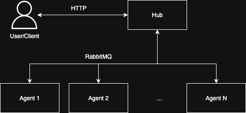

# 🚀 Real-Time Distributed Ping Monitor

A distributed ping monitoring system that provides real-time ICMP ping results across multiple agents using a hub-and-spoke architecture.

## ✨ Features

- **🌐 Distributed Architecture**: Hub coordinates multiple ping agents across different locations
- **⚡ Real-Time Streaming**: Live ping results streamed via WebSocket and HTTP long-polling
- **🔄 Message Queue**: RabbitMQ-powered instant message distribution
- **📊 Parallel Processing**: Ping simultaneously to multiple targets from multiple origins
- **🔧 Configurable**: Customizable ping intervals, timeouts, and retry counts
- **📡 Agent Discovery**: Automatic agent registration and capability detection

## 🏗️ Architecture



## 🚀 Quick Start

### Prerequisites

- Go 1.24+
- RabbitMQ server

### 1. Start RabbitMQ

```bash
# Using Docker
docker-compose up -d

# Or install locally
# RabbitMQ will run on localhost:5672
```

### 2. Start the Hub

```bash
go run cmd/hub/main.go
# Hub runs on localhost:8080
```

### 3. Start Ping Agents

```bash
# Agent 1
go run cmd/agent/main.go -node-name="agent-1"

# Agent 2 (in another terminal)
go run cmd/agent/main.go -node-name="agent-2"
```

### 4. Send Ping Requests

```bash
# Ping from specific agents
curl -X POST http://localhost:8080/ping-task \
  -H "Content-Type: application/json" \
  -d '{
    "from": ["agent-1", "agent-2"],
    "targets": ["google.com", "github.com"],
    "interval": 1000,
    "count": 5
  }'

# Ping from hub, no agents involved
curl -X POST http://localhost:8080/ping-task \
  -H "Content-Type: application/json" \
  -d '{
    "targets": ["8.8.8.8"],
    "interval": 500,
    "count": 3
  }'
```

## 📡 API Endpoints

Following API Endpoints are exposed by the hub:

| Endpoint     | Method    | Description                                       |
| ------------ | --------- | ------------------------------------------------- |
| `/ping-task` | POST      | Submit ping tasks, returns streaming JSON results |
| `/ws`        | WebSocket | Dynamic node registration and discovery           |
| `/conns`     | GET       | List connected agents                             |

## 🔧 Configuration

### Ping Task Parameters

- `targets`: Array of hostnames/IPs to ping
- `from`: Array of agent names (optional, defaults to local)
- `interval`: Ping interval in milliseconds (default: 1000ms)
- `count`: Number of pings per target (default: 3)
- `timeout`: Ping timeout in milliseconds (default: 10000ms)

### Agent Configuration

```bash
go run cmd/agent/main.go \
  -node-name="my-agent" \
  -addr="localhost:8080" \
  -rabbitmq-broker-url="amqp://localhost:5672/"
```
